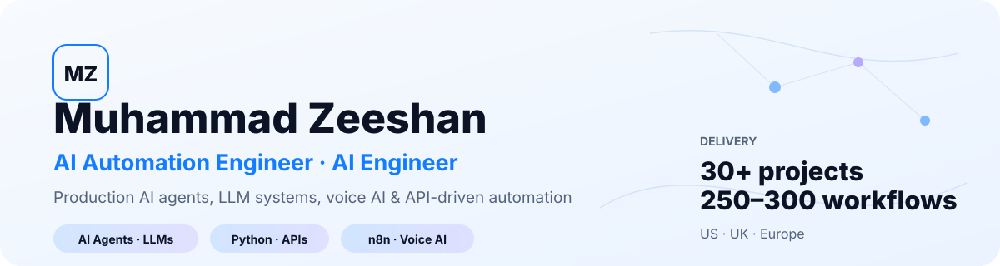
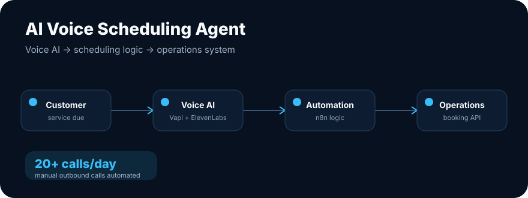
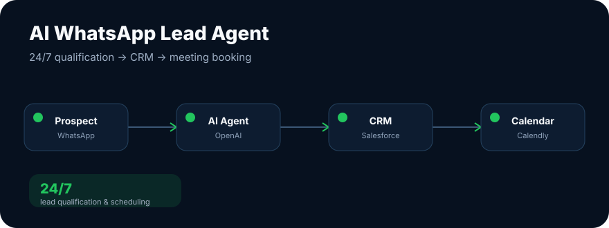
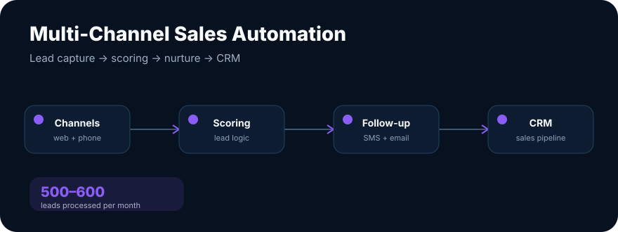
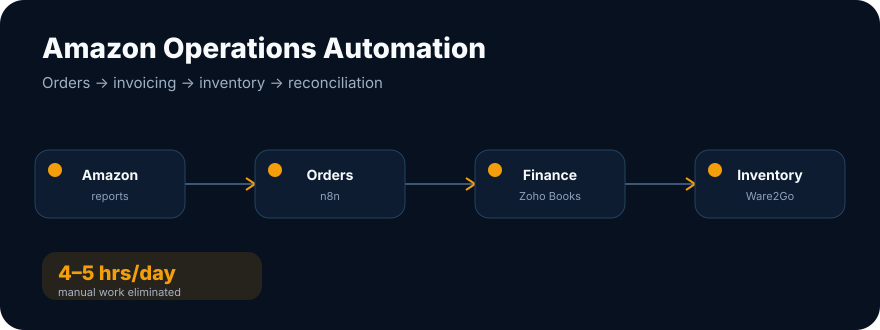
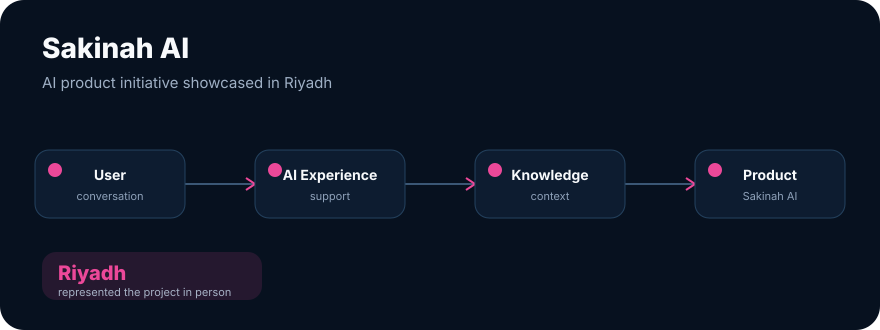

<picture>
  <source media="(prefers-color-scheme: dark)" srcset="./github-banner-dark.svg">
  <source media="(prefers-color-scheme: light)" srcset="./github-banner-light.svg">
  
</picture>

<p align="center">
  <a href="https://zeeshan-ai-engineer-portfolio.vercel.app/">
    
  </a>
  <a href="https://www.linkedin.com/in/muhammad-zeeshan-chandia/">
    
  </a>
  <a href="mailto:m.zeeshanchandia1@gmail.com">
    
  </a>
</p>

## I build AI systems that connect to real operations

I'm **Muhammad Zeeshan**, an **AI Automation Engineer** at **GoArrow AI**. I design, build, and deploy production AI agents and automation systems for businesses across the **US, UK, and Europe**.

My work sits at the intersection of **LLMs, AI agents, workflow automation, voice AI, Python, APIs, CRMs, and business systems** — with a focus on reliability, measurable outcomes, and end-to-end delivery.

<table>
  <tr>
    <td align="center"><strong>30+</strong><br><sub>Client projects</sub></td>
    <td align="center"><strong>250–300</strong><br><sub>Production workflows</sub></td>
    <td align="center"><strong>&lt; 1 min</strong><br><sub>Lead response time achieved</sub></td>
    <td align="center"><strong>4–5 hrs/day</strong><br><sub>Manual work eliminated</sub></td>
  </tr>
</table>

---

## Featured engineering work

### AI Voice Scheduling Agent



Built a production voice AI system that contacts customers when service is due, handles natural scheduling conversations, and books appointments directly into the client's operations system.

**Stack:** `Vapi` `ElevenLabs` `n8n` `Google Maps API` `Custom APIs`  
**Impact:** Replaced **20+ manual outbound calls per day** and added route-aware scheduling logic.

---

### AI WhatsApp Lead Qualification Agent



Built a 24/7 conversational agent that engages prospects on WhatsApp, qualifies leads, updates Salesforce, and handles meeting booking against live Calendly availability.

**Stack:** `n8n` `OpenAI` `Salesforce` `Calendly` `WhatsApp Business API`  
**Impact:** Automated the full **lead → qualification → CRM → meeting** workflow.

---

### Multi-Channel Sales Automation



Designed a lead capture, scoring, nurture, and follow-up system spanning web forms, phone calls, SMS, email, and CRM activity.

**Stack:** `Zapier` `OrbisX CRM` `OpenPhone` `Gmail` `Google Sheets`  
**Impact:** Handles **500–600 leads/month** and reduced first response time from **30+ minutes to under 1 minute**.

---

### Amazon Order, Inventory & Invoicing Automation



Automated order processing, invoicing, inventory synchronization, returns, refunds, duplicate protection, and reconciliation across e-commerce operations.

**Stack:** `n8n Cloud` `Zoho Books` `Ware2Go` `Google Drive` `Amazon Marketplace Reports`  
**Impact:** Processes around **50 orders/day** and removed **4–5 staff hours of manual work per day**.

---

### Sakinah AI



Contributed to **Sakinah AI**, an AI-powered support initiative, and represented the project in **Riyadh** while engaging with healthcare and technology stakeholders.

**Focus:** `AI product development` `Conversational experience` `Applied AI`

> Some client implementations are described at architecture level to respect confidentiality.

---

## Core engineering stack

<table>
  <tr>
    <td valign="top" width="25%">
      <strong>AI & LLMs</strong><br><br>
      OpenAI<br>
      Anthropic Claude<br>
      AI Agents<br>
      RAG<br>
      Embeddings<br>
      Prompt Engineering
    </td>
    <td valign="top" width="25%">
      <strong>Engineering</strong><br><br>
      Python<br>
      REST APIs<br>
      Webhooks<br>
      OAuth 2.0<br>
      JSON<br>
      API Authentication
    </td>
    <td valign="top" width="25%">
      <strong>Automation</strong><br><br>
      n8n<br>
      Make<br>
      Zapier<br>
      GoHighLevel<br>
      Business Process Automation
    </td>
    <td valign="top" width="25%">
      <strong>Platforms & Data</strong><br><br>
      Salesforce<br>
      HubSpot<br>
      Supabase / PostgreSQL<br>
      Zoho Books<br>
      Airtable<br>
      Google Workspace
    </td>
  </tr>
</table>

---

## How I approach production AI

```text
Understand the business process
        ↓
Map systems, data & failure points
        ↓
Design the AI / automation architecture
        ↓
Build integrations & orchestration
        ↓
Add validation, retries, deduplication & logging
        ↓
Deploy, observe & improve
```

I care about the engineering around the model — **state, APIs, failure handling, data quality, permissions, observability, and business outcomes** — not just getting an LLM demo to work.

---

## Current focus

I'm targeting **AI Automation Engineer / AI Engineer / AI Developer** roles where I can work on:

`AI Agents` · `LLM Applications` · `RAG` · `Voice AI` · `Workflow Automation` · `API Integrations` · `Production AI Systems`

I also continue to explore applied machine learning in Python with `scikit-learn`, model evaluation, classification, regression, and NLP.

---

## Connect

<p>
  <strong>Portfolio:</strong> <a href="https://zeeshan-ai-engineer-portfolio.vercel.app/">zeeshan-ai-engineer-portfolio.vercel.app</a><br>
  <strong>LinkedIn:</strong> <a href="https://www.linkedin.com/in/muhammad-zeeshan-chandia/">muhammad-zeeshan-chandia</a><br>
  <strong>Email:</strong> <a href="mailto:m.zeeshanchandia1@gmail.com">m.zeeshanchandia1@gmail.com</a>
</p>
